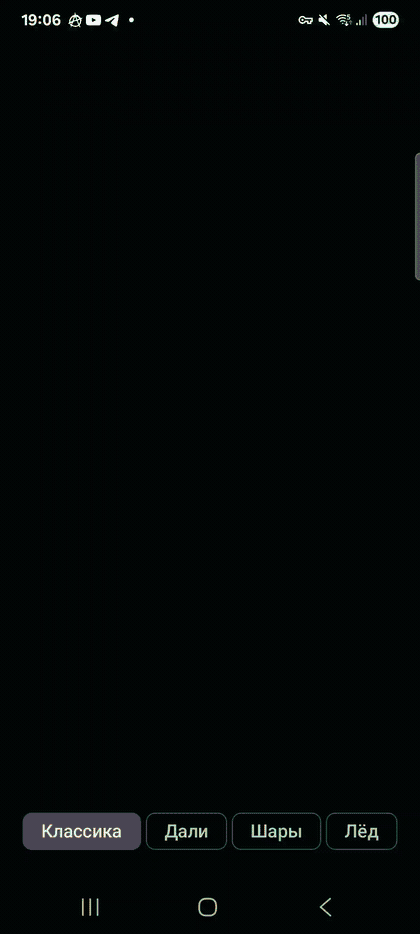
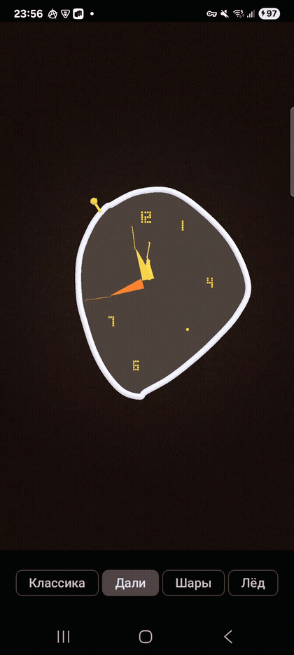
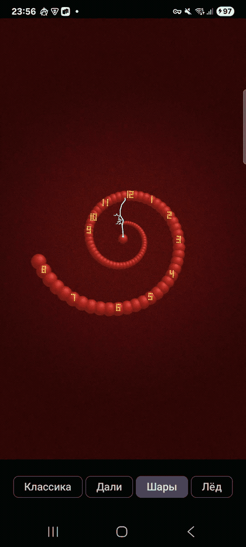
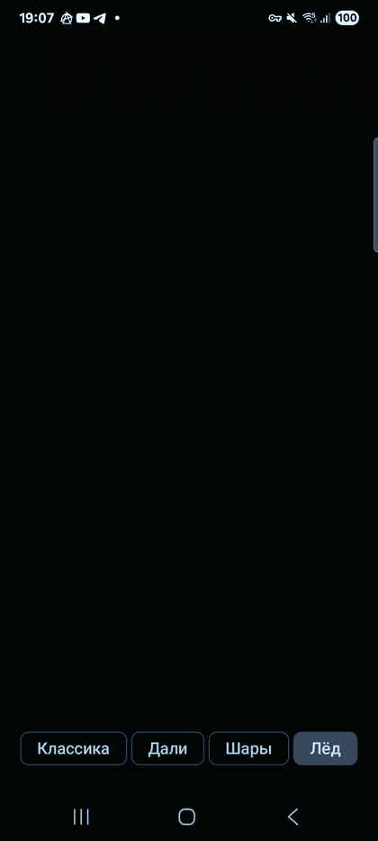

# Clock3D

**Four real-time 3D clock faces** on OpenGL ES 3.0, built with [**RedByteFX**](https://github.com/i-redbyte/redbytefx) (`io.github.i-redbyte:redbytefx-*:1.1.0`).

Kotlin · Jetpack Compose · GLES shaders in the RedByteFX DSL · scene meshes from `redbytefx-3d`

> **Media:** GIFs live in [`docs/media/`](docs/media/). Open this README from the **clock3d** project root (paths are relative to this file).

Recordings: **Samsung Galaxy S21**, physical device, ~4 s screen capture each - not an emulator.

---

## Examples · Примеры

### 1 · Classic · Классика

**EN** - Analog dial with hour, minute, and second hands. Tap the face for a short camera spin.

**RU** - Циферблат со стрелками; касание экрана даёт короткий поворот камеры.

#### Math · Математика

<strong>English</strong> - how Classic is built (OpenGL basics)

**What you see on screen** is a list of triangles. Each corner has a position `(x, y, z)` and a **normal** (which way the surface faces) so the GPU can shade it.

**Time → angles.** We read the real clock from the phone. Seconds include milliseconds so the second hand moves smoothly. For each hand we compute one angle on a full circle: hour uses “hour + minute/60”, minute uses “minute + second/60”. In code the hand mesh points along **+Y** at 12 o’clock; a **rotation around Z** turns it toward 3, 6, 9 o’clock. The sign is chosen so clockwise motion on the dial matches wall-clock time.

**Matrices (the usual OpenGL idea).** A **model matrix** moves a mesh from “model space” into the world. We build it by multiplying small matrices: **translation** (shift), **rotation** (turn). For each hand: first rotate around Z by the hand angle, then translate a bit along **+Z** so the hand floats above the face (avoids flickering when two surfaces are at the same depth). For the dial: a fixed tilt around **X** so you see it in 3D. When you tap, we add a rotation around **Y** that starts fast and eases to zero (`1 - e^(-t)`), like a coin spin that settles-so the dial returns to a stable orientation.

**Final hand matrix** = `bodyWorld × handPose`. The body matrix is shared; each hand has its own pose. In the **vertex shader**, each vertex position is multiplied by the model matrix, then by the **view** matrix (camera), then by **projection**.

**Camera.** `lookAt(eye, center, up)` builds the view matrix: the eye sits in front of the dial, looking at the origin. **Orthographic** projection maps the scene to the screen without perspective: parallel lines stay parallel; the clock reads like a technical drawing, not a wide-angle photo. The box width/height is adjusted for screen **aspect ratio** so nothing is stretched.

**Drawing order.** Dark backdrop first, then the merged dial (disc, torus bezel, ticks, block digits), then three separate draws for hour / minute / second meshes. A uniform `material` id (or UV.x) tells the **fragment shader** which color recipe to use (face, rim, hand, digit).

**Lighting.** Fragment stage uses a simple **Lambert** term: `brightness ∝ dot(normal, lightDirection)`. No shadows-just enough to sell volume on the hands and bezel.

<strong>Русский</strong> - как устроена «Классика» (база OpenGL)

**Картинка на экране** - набор треугольников. У каждой вершины есть координата `(x, y, z)` и **нормаль** (куда «смотрит» грань), чтобы GPU мог закрасить поверхность.

**Время → углы.** Берём реальные часы телефона. Секунды учитывают миллисекунды - секундная стрелка движется плавно. Для каждой стрелки считаем один угол на полном круге: час = «час + минута/60», минута = «минута + секунда/60». Меш стрелки изначально направлен по **+Y** (на 12 часов); **поворот вокруг Z** разворачивает её к 3, 6, 9. Знак выбран так, чтобы движение по циферблату совпадало с обычными часами.

**Матрицы (стандартная схема OpenGL).** **Матрица модели** переносит объект из «локальных» координат в мир. Собираем её перемножением простых матриц: **сдвиг** (translation) и **поворот** (rotation). Для стрелки: поворот вокруг Z на нужный угол, затем небольшой сдвиг по **+Z**, чтобы стрелка чуть над циферблатом (меньше мерцания на одной глубине). Для циферблата - постоянный наклон вокруг **X**, чтобы видеть объём. По тапу добавляем поворот вокруг **Y**: быстрый старт и плавное затухание (`1 - e^(-t)`), как монетка, которая крутится и останавливается.

**Итог для стрелки** = `bodyWorld × handPose`. Матрица корпуса общая; у каждой стрелки своя поза. В **вершинном шейдере** позицию вершины умножают на модель, затем на **вид** (камера), затем на **проекцию**.

**Камера.** `lookAt(глаз, центр, вверх)` задаёт матрицу вида: камера перед циферблатом, смотрит в центр. **Ортографическая** проекция не даёт «перспективы»: параллельные линии остаются параллельными, часы читаются как на чертеже. Размеры окна проекции подстраиваются под **соотношение сторон** экрана.

**Порядок отрисовки.** Фон, затем слитый циферблат (диск, ободок-тор, метки, блочные цифры), затем три отрисовки стрелок. Uniform `material` (или UV.x) говорит **фрагментному шейдеру**, какой цвет применить (лицо, обод, стрелка, цифра).

**Свет.** Во фрагменте простой **Ламберт**: яркость зависит от `dot(нормаль, направление_света)`. Теней нет - только объём на стрелках и ободе.

---

### 2 · Dalí · Дали

**EN** - Rigid dial plus soft “melt” geometry; vertex displacement in the same RedByteFX program.

**RU** - Жёсткий циферблат и «стекающая» геометрия в вершинном шейдере.

#### Math · Математика

<strong>English</strong> - melting watch geometry

**Starting shape.** The Dalí face is not a perfect circle. Artists’ control points form a closed loop in the **XY plane** (like connecting dots). That loop is **resampled** to many evenly spaced points (Catmull–Rom spline) so the mesh is smooth.

**The “melt” is vertex animation on the CPU.** Every frame, for each point we run the same function `flowInto(x, y, z, time)`:

- Points lower on the dial (larger “drip” factor from **−Y**) move downward more-this mimics gravity without physics.
- `sin` and `cos` of time and of position add wobble and shear so the outline breathes.
- **Z** gets a small ripple so the surface is not flat cardboard.

There is no cloth simulation-only formulas that shift coordinates, then we upload new vertex buffers to OpenGL.

**Building the solid.** The filled face is an **extruded polygon**: the 2D outline copied to top and bottom Z with side quads. The silver rim is a **tube** following the same outline (a string of small cylinders around the edge). A crown and a few numerals are separate meshes placed on the warped outline.

**Hands.** Hand meshes are built once in a straight pose. Each frame we copy template vertices through `flowInto` into a buffer and call `replace()` so the GPU sees the update. Rotation matrices for hands are still the same as Classic-the geometry bends, the math that points the hand at the correct time does not.

**Whole-body motion.** Besides warp, the dial gets `hoverPose`: tiny translations in X/Y from slow sines and a small yaw around Y, multiplied with the same tilt as Classic. So the watch floats slightly while melting.

**Shader.** Same program as other modes; `mode` uniform selects warmer colors and a slightly different shading mix on the Dalí branch.

<strong>Русский</strong> - геометрия «тающих» часов

**Исходная форма.** Циферблат Дали - не идеальный круг. Контрольные точки образуют замкнутый контур в плоскости **XY**. Контур **пересчитывается** в много равномерных точек (сплайн Catmull–Rom), чтобы сетка была гладкой.

**«Течение» - анимация вершин на CPU.** Каждый кадр для каждой точки вызывается `flowInto(x, y, z, время)`:

- Чем ниже точка на циферблате (через коэффициент «капли» от **−Y**), тем сильнее сдвиг вниз - имитация гравитации без физики.
- `sin` и `cos` от времени и координат дают покачивание и сдвиг контура.
- По **Z** - лёгкая рябь, чтобы поверхность не была плоской.

Никакой симуляции ткани: только сдвиг координат и загрузка буфера в OpenGL.

**Объём.** Заливка - **выдавленный многоугольник**: контур на двух уровнях Z и боковые грани. Обод - **трубка** вдоль того же контура. Корона и часть цифр - отдельные меши на деформированном контуре.

**Стрелки.** Меш стрелки собран в «прямой» позе один раз. Каждый кадр вершины шаблона прогоняются через `flowInto`, буфер обновляется через `replace()`. Матрицы поворота как в «Классике» - меняется форма, не логика времени.

**Движение корпуса.** Плюс warp: `hoverPose` - маленькие сдвиги по X/Y на медленных синусах и лёгкий поворот вокруг Y, вместе с наклоном как у классики.

**Шейдер.** Один программный объект на все режимы; uniform `mode` включает более тёплые цвета и чуть другой расчёт яркости.

---

### 3 · Spheres · Шары

**EN** - Ring of instanced spheres, animated lightning, hands above the halo (`instanceModel()`, stdlib palettes).

**RU** - Кольцо сфер, «молнии», стрелки поверх; инстансинг и палитры stdlib.

#### Math · Математика

<strong>English</strong> - spiral, spin, and lightning

**Spiral layout (where each sphere goes).** Imagine unrolling a nautilus-like coil on the dial plane:

1. Take a parameter `t` from 0 (center) to 1 (outer edge).
2. Angle `θ = t × (number of turns) × 2π` - how far around the circle you have wound.
3. Radius `r` grows from small to large using a normalized exponential `(e^(k·t) − 1) / (e^k − 1)` so the spacing widens smoothly, not linearly.
4. Position: `x = sin θ · r`, `y = cos θ · r`, small `z` for a bit of depth.

Each bead is a **sphere mesh** translated to that point; larger `t` often means a slightly larger sphere radius. The whole merged mesh is one draw call; per-bead transforms are baked into vertex positions on the CPU.

**Slow rotation.** The body matrix multiplies a fixed tilt with `rotationZ(-time × 0.16)` so the halo drifts counterclockwise while real hand angles still come from the clock.

**Hour labels on the spiral.** For each hour 1…12 we find the bead whose angle on the spiral is closest to that hour’s direction on a clock (only among beads past a certain `t` so labels sit on the outer coil). Block-digit meshes are placed at those bead positions.

**Lightning hands (procedural polylines).** Instead of solid spears we build jagged paths:

1. Start with a segment from the center toward a capped length (so tips stay inside the outer bound).
2. **Midpoint displacement:** for each segment, insert a point at the middle, offset perpendicular to the segment by a random amount (from a deterministic `sin` hash of a seed).
3. Repeat several levels so the line looks like a fractal bolt.
4. Optional side branches split off partway along the main path.

Small boxes along each segment form the visible stroke; a glow box and a hub sphere finish the look. Every few seconds the **generation** index changes (`floor(time × tempo + offset)`), so new seeds → new bolt shapes. Hand **rotation** matrices are unchanged; only the mesh geometry swaps.

**Color and sparkle in the shader.** For Spheres mode the fragment shader mixes cosine palettes, a time-based pulse, and `grain` noise from screen-like coordinates derived from world position. That is why the beads shimmer without moving individual vertices every frame.

**Hand length cap.** `handReach` uniforms tell the shader how far lightning may extend so tips do not stick out past the outer spiral silhouette.

<strong>Русский</strong> - спираль, вращение и молнии

**Расстановка спирали (где каждый шар).** На плоскости циферблата разворачиваем спираль, похожую на раковину:

1. Параметр `t` от 0 (ближе к центру) до 1 (к краю).
2. Угол `θ = t × (число витков) × 2π` - сколько оборотов прошли.
3. Радиус `r` растёт по сглаженной **экспоненте** `(e^(k·t) − 1) / (e^k − 1)`, чтобы витки расширялись плавно.
4. Позиция: `x = sin θ · r`, `y = cos θ · r`, небольшой `z` для глубины.

Каждый шар - mesh-сфера, перенесённая в эту точку; дальше от центра шар часто чуть крупнее. Все шары сливаются в один меш и рисуются одним вызовом; сдвиги посчитаны на CPU.

**Медленное вращение.** Матрица корпуса = наклон × `rotationZ(-время × 0.16)` - ореол плывёт, а углы стрелок по-прежнему от системных часов.

**Цифры на спирали.** Для каждого часа 1…12 ищем шарик, чей угол на спирали ближе всего к направлению этого часа (среди точек с достаточно большим `t`, чтобы цифры были снаружи). Туда ставим блочные цифры.

**Стрелки-молнии (ломаная линия).** Вместо цельных «копий»:

1. От центра к ограниченной длине (чтобы кончик не вылез за внешний контур спирали).
2. **Серединный сдвиг:** каждый отрезок делим пополам, середину смещаем перпендикулярно на случайную величину (псевдослучайность от `sin` и seed).
3. Несколько уровней - изломанная «молния».
4. Ответвления уходят с середины основной линии.

Вдоль отрезков - тонкие боксы; в центре - сфера. Раз в несколько секунд меняется **поколение** (`floor(время × темп + сдвиг)`), seed другой - другая форма. Матрицы поворота стрелок те же, меняется только mesh.

**Цвет во фрагментном шейдере.** В режиме «Шары» смешиваются палитры, пульс от времени и шум `grain` из координат, похожих на экранные, из мировой позиции - блеск без покадрового движения каждой вершины.

**Длина молний.** Uniform `handReach` ограничивает, как далеко молния может тянуться от центра.

---

### 4 · Ice · Лёд

**EN** - Frosted crystal, shell, and mist with alpha blending. Swipe horizontally to orbit the camera.

**RU** - Лёд, оболочка и туман с альфа-смешиванием; горизонтальный свайп вращает камеру.

#### Math · Математика

<strong>English</strong> - crystal mesh, orbit, transparency

**Coordinate habit.** The quartz crystal stands along **+Y** (tall). The hexagon lives in the **XZ** plane (width and depth). That matches how you “look into” a cut gem on a table.

**Hex prism + pyramids.** Six vertices on the top ring and six on the bottom (slightly smaller), connected by side quads. Two pyramid tips: one on top, one on the bottom. Each face is two **triangles** (or a quad split into two). For every triangle we compute a **normal** with the cross product of two edge vectors, then normalize-OpenGL uses that normal in the Lambert term so facets catch light at different angles.

**Interior dial.** Inside the solid we place a thin disc, tick marks on a circle (`placeOnDial`: translate to radius × (sin θ, cos θ) and rotate the mark), block digits on a smaller ring, decorative cracks and bubbles as extra triangles. Hands are slimmer needles with small hub spheres.

**Orbit from swipe (not moving the camera).** Horizontal drag updates `iceYaw`. The body matrix = strong tilt around X × rotation around Y by `iceYaw`. The **camera stays fixed**; you spin the crystal in front of it-same effect as orbiting with a trackball, but implemented as one model matrix.

**Two transparent passes after the opaque body.**

1. **Shell** - outer hull mesh, same transform as the stone. Blending: source alpha × color **added** to the framebuffer (`SrcAlpha`, `One`), depth writes **off** so inner geometry still shows through glowing edges.
2. **Mist** - large horizontal discs behind/around the crystal, low alpha, standard alpha-over (`SrcAlpha`, `OneMinusSrcAlpha`).

Draw order matters: opaque dial and hands first, then shell, then mist. Depth test stays on for solids so hands stay in front of the face.

**Projection.** Slightly tighter ortho radius than Classic so the tall crystal fits the frame. Light direction is more “from above” for a cold, icy read.

**Same time math.** Hour/minute/second angles are identical to Classic; only meshes and materials change.

<strong>Русский</strong> - кристалл, орбита, прозрачность

**Оси.** Кристалл вытянут по **+Y** (высота). Шестиугольник лежит в плоскости **XZ** (ширина и глубина) - как огранённый камень на столе.

**Призма и пирамидки.** Шесть вершин на верхнем кольце и шесть на нижнем (чуть меньше), между ними боковые грани. Два кончика-пирамиды сверху и снизу. Каждая грань - пара **треугольников**. **Нормаль** грани - нормализованное **кросс-произведение** двух рёбер; по ней считается Ламберт, грани блестят по-разному.

**Циферблат внутри.** Тонкий диск, метки по кругу (`placeOnDial`: сдвиг на радиус × (sin θ, cos θ) и поворот метки), блочные цифры, трещины и «пузырьки» включений. Стрелки - тонкие иглы с сферой в центре.

**Свайп = вращение модели, не камеры.** Горизонтальный жест меняет `iceYaw`. Матрица корпуса = сильный наклон вокруг X × поворот вокруг Y на `iceYaw`. **Камера не едет** - вращаете камень перед ней (как trackball, но одной матрицей модели).

**Два прозрачных прохода после непрозрачного тела.**

1. **Оболочка** - внешняя оболочка, та же матрица, что у камня. Смешивание: цвет с альфой **прибавляется** к кадру (`SrcAlpha`, `One`), **без записи глубины** - светящиеся грани поверх внутренности.
2. **Туман** - большие диски сзади/вокруг, слабая альфа, обычное «альфа поверх» (`SrcAlpha`, `OneMinusSrcAlpha`).

Порядок: непрозрачные детали и стрелки, затем оболочка, затем туман. Для твёрдых частей тест глубины включён.

**Проекция.** Ортографическое окно чуть меньше, чем в «Классике», чтобы высокий кристалл влез в кадр. Свет чуть сверху - «холодный» вид.

**Время.** Углы стрелок считаются так же, как в «Классике»; меняются только меши и материалы.

---

Made with [RedByteFX](https://github.com/i-redbyte/redbytefx) · [Maven Central](https://central.sonatype.com/search?q=io.github.i-redbyte%20redbytefx)
